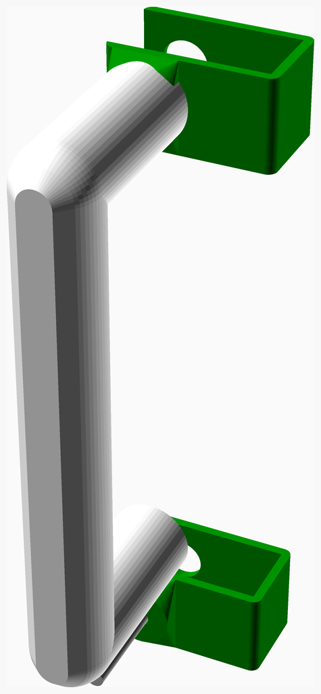
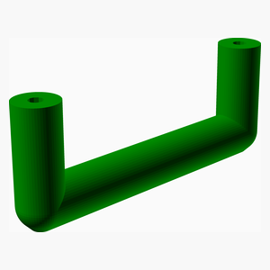
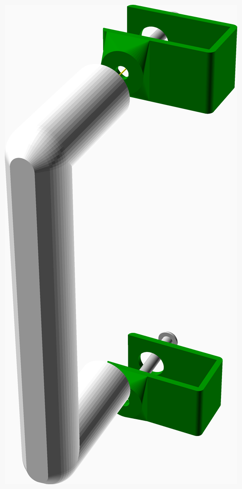

# DoorHandleTester

---
## Table of Contents
1. [Parts list](#Parts_list)
1. [DoorHandleTester Clamp Assembly](#DoorHandleTester_Clamp_assembly)

[Top](#TOP)

---

## Parts list
| DoorHandleTester&nbsp;Clamp | TOTALS |  |
|---:|---:|:---|
|  | | **Vitamins** |
| &nbsp;&nbsp;2&nbsp; |  &nbsp;&nbsp;2&nbsp; | &nbsp;&nbsp; Screw M4 dome x 25mm |
| &nbsp;&nbsp;2&nbsp; | &nbsp;&nbsp;2&nbsp; | &nbsp;&nbsp;Total vitamins count |
|  | | **3D printed parts** |
| &nbsp;&nbsp;2&nbsp; |  &nbsp;&nbsp;2&nbsp; | &nbsp;&nbsp;DoorHandleTester_Clamp.stl |
| &nbsp;&nbsp;1&nbsp; |  &nbsp;&nbsp;1&nbsp; | &nbsp;&nbsp;handle.stl |
| &nbsp;&nbsp;3&nbsp; | &nbsp;&nbsp;3&nbsp; | &nbsp;&nbsp;Total 3D printed parts count |

[Top](#TOP)

---

## DoorHandleTester Clamp Assembly
### Vitamins
|Qty|Description|
|---:|:----------|
|2| Screw M4 dome x 25mm|

### 3D Printed parts

| 2 x DoorHandleTester_Clamp.stl | 1 x handle.stl |
|---|---|
|  |  

### Assembly instructions

Attach handle to clamp

[Top](#TOP)

---
Assemble all parts 

[Top](#TOP)
