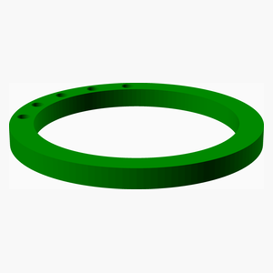

# KitchenVent

---
## Table of Contents
1. [Parts list](#Parts_list)
1. [KitchenVent Outlet Assembly](#KitchenVent_Outlet_assembly)
1. [KitchenVent TopMount Assembly](#KitchenVent_TopMount_assembly)
1. [KitchenVent ShelfCover Assembly](#KitchenVent_ShelfCover_assembly)
1. [Main Assembly](#main_assembly)

[Top](#TOP)

---

## Parts list
| KitchenVent&nbsp;Outlet | KitchenVent&nbsp;TopMount | KitchenVent&nbsp;ShelfCover | Main | TOTALS |  |
|---:|---:|---:|---:|---:|:---|
|  |  |  |  | | **Vitamins** |
| &nbsp;&nbsp;.&nbsp; | &nbsp;&nbsp;4&nbsp; | &nbsp;&nbsp;.&nbsp; | &nbsp;&nbsp;.&nbsp; |  &nbsp;&nbsp;4&nbsp; | &nbsp;&nbsp; Screw 6-32 pan x 16mm |
| &nbsp;&nbsp;.&nbsp; | &nbsp;&nbsp;4&nbsp; | &nbsp;&nbsp;.&nbsp; | &nbsp;&nbsp;.&nbsp; |  &nbsp;&nbsp;4&nbsp; | &nbsp;&nbsp; Washer  M4 x 9mm x 0.8mm |
| &nbsp;&nbsp;.&nbsp; | &nbsp;&nbsp;8&nbsp; | &nbsp;&nbsp;.&nbsp; | &nbsp;&nbsp;.&nbsp; | &nbsp;&nbsp;8&nbsp; | &nbsp;&nbsp;Total vitamins count |
|  |  |  |  | | **3D printed parts** |
| &nbsp;&nbsp;1&nbsp; | &nbsp;&nbsp;.&nbsp; | &nbsp;&nbsp;.&nbsp; | &nbsp;&nbsp;.&nbsp; |  &nbsp;&nbsp;1&nbsp; | &nbsp;&nbsp;KitchenVent_Outlet_bottom.stl |
| &nbsp;&nbsp;1&nbsp; | &nbsp;&nbsp;.&nbsp; | &nbsp;&nbsp;.&nbsp; | &nbsp;&nbsp;.&nbsp; |  &nbsp;&nbsp;1&nbsp; | &nbsp;&nbsp;KitchenVent_Outlet_top.stl |
| &nbsp;&nbsp;.&nbsp; | &nbsp;&nbsp;.&nbsp; | &nbsp;&nbsp;1&nbsp; | &nbsp;&nbsp;.&nbsp; |  &nbsp;&nbsp;1&nbsp; | &nbsp;&nbsp;KitchenVent_ShelfCover.stl |
| &nbsp;&nbsp;.&nbsp; | &nbsp;&nbsp;1&nbsp; | &nbsp;&nbsp;.&nbsp; | &nbsp;&nbsp;.&nbsp; |  &nbsp;&nbsp;1&nbsp; | &nbsp;&nbsp;KitchenVent_TopMount.stl |
| &nbsp;&nbsp;2&nbsp; | &nbsp;&nbsp;1&nbsp; | &nbsp;&nbsp;1&nbsp; | &nbsp;&nbsp;.&nbsp; | &nbsp;&nbsp;4&nbsp; | &nbsp;&nbsp;Total 3D printed parts count |

[Top](#TOP)

---

## KitchenVent Outlet Assembly
### 3D Printed parts

| 1 x KitchenVent_Outlet_bottom.stl | 1 x KitchenVent_Outlet_top.stl |
|---|---|
|  |  

### Assembly instructions

Glue printed parts together

[Top](#TOP)

---

## KitchenVent TopMount Assembly
### Vitamins
|Qty|Description|
|---:|:----------|
|4| Screw 6-32 pan x 16mm|
|4| Washer  M4 x 9mm x 0.8mm|

### 3D Printed parts

| 1 x KitchenVent_TopMount.stl |
|---|
|  

### Assembly instructions

Assemble top mount 

[Top](#TOP)

---

## KitchenVent ShelfCover Assembly
### 3D Printed parts

| 1 x KitchenVent_ShelfCover.stl |
|---|
|  

### Assembly instructions

Assemble shelf cover 

[Top](#TOP)

---

## Main Assembly
### Sub-assemblies

| 1 x KitchenVent_Outlet_assembly | 1 x KitchenVent_ShelfCover_assembly | 1 x KitchenVent_TopMount_assembly |
|---|---|---|
|  |  |  

### Assembly instructions

Assemble all parts 

[Top](#TOP)
